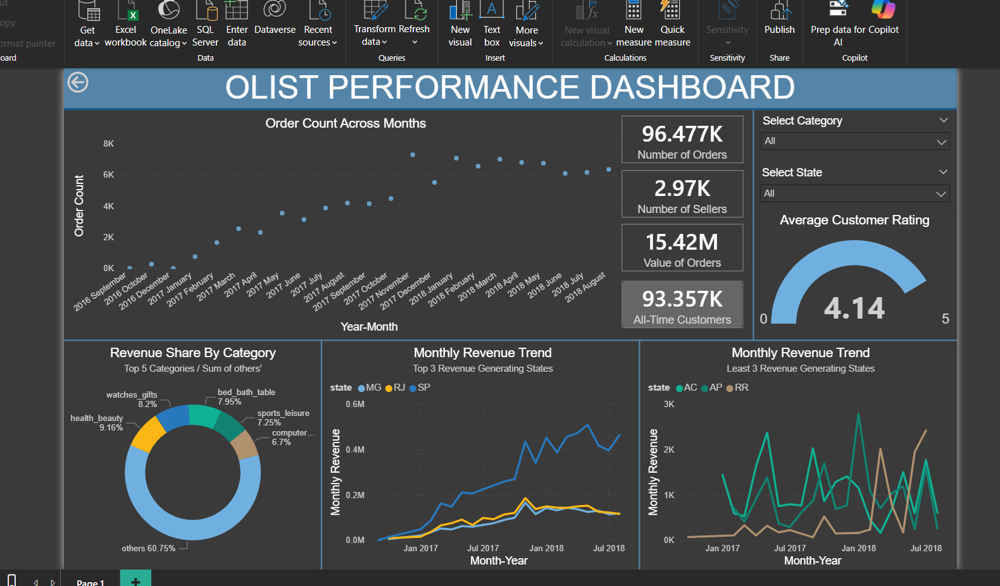
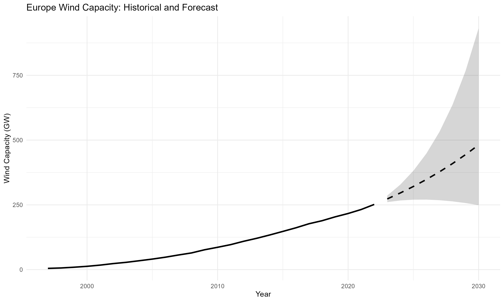

## Manoj K N
Computer Science Undergraduate  
Bengaluru, Karnataka, India  

---
### About Me
I am an aspiring data analyst with a strong foundation in statistical modelling, visualisation and focused on building end-to-end analytical workflows from raw data to actionable insights.

My work includes:
- End-to-end data analysis pipelines
- Exploratory Data Analysis (EDA)
- Regression and time series modelling
- Quantitative Forecasting
- Dashboard development for business insights

I focus on combining statistical reasoning with clear interpretation of results.

---
### Tools & Technologies

**Languages & Tools**
- R (modelling, time series, visualisation)
- SQL (MySQL - querying, transformations, analytical views)
- Power BI (dashboard design, data modelling, reporting)
- Excel (data cleaning and analysis)

**Core Techniques**
- Data cleaning and transformation
- Exploratory Data Analysis (EDA)
- Regression modelling
- Time series forecasting (ARIMA, ARIMAX)
- Model evaluation (RMSE, MAE)
- Residual diagnostics (ACF/PACF)
- KPI design and dashboard data modelling

---
### Featured Projects

#### E-Commerce Marketplace Analysis  
*Focus: End-to-end analytics pipeline, KPI modelling, and dashboarding*  

- Designed SQL-based ETL pipeline for transforming raw transactional data  
- Built KPI views (GMV, AOV, revenue trends, regional performance)  
- Developed interactive Power BI dashboard with filters and drill-downs  

  Performance Dashboard

**Key Insight:** Revenue is highly concentrated in a few regions, while long-tail product categories collectively contribute significant value  
**Repository:** https://github.com/manojn0010/E-Commerce-Marketplace-Analysis  

---
#### Forecasting Wind Energy Adoption
*Focus: Time series modelling and forecast accuracy*

- Built and compared regression, ARIMAX, and ARIMA models  
- Applied transformations and stationarity checks  
- Used train-test validation for model selection

  Forecast Plot

**Key Insight:** Time series structure outperforms external variables - ARIMA delivers significantly better forecasts than models with economic drivers  
**Repository:** https://github.com/manojn0010/Forecasting-Wind-Energy-Adoption  

---
#### Demographic Modelling of Population Dynamics
*Focus: Regression modelling and structural analysis*

- Built multiple regression specifications with demographic and policy variables  
- Compared models using statistical metrics  
- Analysed dynamic effects using lagged growth

  Model Comparison  
|model|adj.r.squared|sigma|statistic|
|---|---|---|---|
|model1|0.90168|0.25852|190.5394|
|model2|0.90277|0.25709|288.8392|
|model3|0.90451|0.25478|196.7654|
|model4|0.97716|0.11800|653.4687|

**Key Insight:** Population growth shows strong persistence - past growth significantly influences future trends  
**Repository:** https://github.com/manojn0010/Demographic-Modelling-of-Population-Dynamics  

---
### Contact
**GitHub:** https://github.com/manojn0010  
**Email:** [manojkn2123@gmail.com](mailto:manojkn2123@gmail.com)

---
Open to entry-level data analyst roles focused on modelling, forecasting, dashboarding, and analytical problem-solving.
